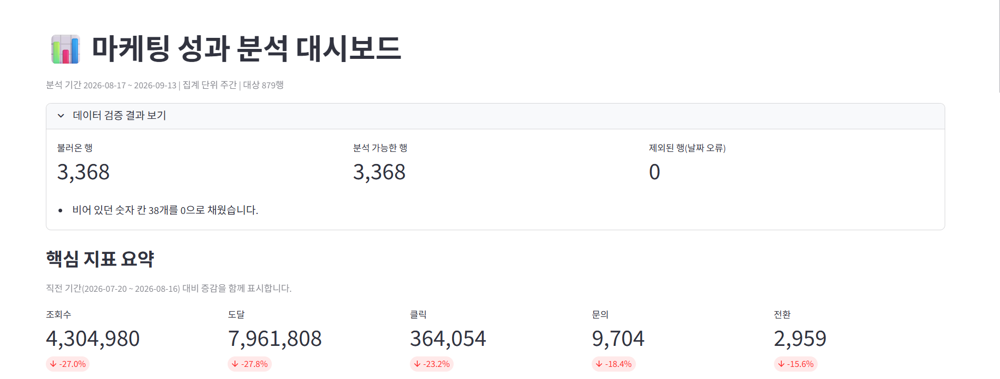
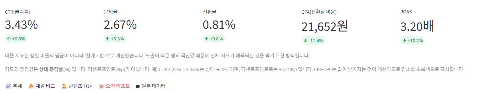
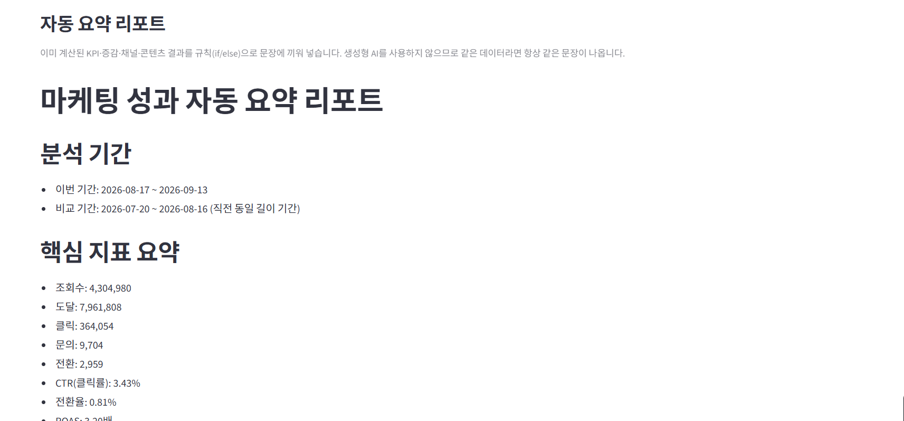

# 마케팅 성과 분석 대시보드

주간 마케팅 성과 취합·보고를 자동화하는 대시보드


**🚀 [라이브 데모 바로가기](https://taebin0520-sys-marketing-performance-dashboard-app-30zb6r.streamlit.app)** — 설치 없이 브라우저에서 확인할 수 있습니다.

> 무료 티어 배포라 앱이 슬립 상태면 첫 접속에 수십 초가 걸릴 수 있습니다.

**데이터 검증 결과와 핵심 지표 요약** — 직전 동일 기간 대비 증감을 함께 표시합니다.



**효율 지표** — CPA는 값이 낮아지는 것이 개선이므로 감소를 초록색으로 표시합니다.



**자동 요약 리포트** — 규칙 기반으로 생성하며 생성형 AI를 쓰지 않습니다.



---

## 이 프로젝트에서 보여주고 싶은 것

1. **지표 계산의 정확성** — 비율 KPI를 행별 평균이 아니라 `합계 ÷ 합계`로 계산하고, 0으로 나누는 경우를 `None`으로 처리하며, 상대 증감률(%)과 퍼센트포인트(%p)를 구분해 표기했습니다.
2. **관찰과 제안을 분리한 자동 리포트** — 규칙 기반으로 문장을 만들되 "예산을 늘려야 한다"처럼 단정하지 않고, 관찰된 사실과 확인이 필요한 항목을 나눠 씁니다.
3. **계산 결과를 테스트로 고정** — pytest 84개와 GitHub Actions CI로 지표 계산과 표현 규칙이 깨지지 않는지 자동 검증합니다.

---

## 제작 방식

코드 구현에는 AI IDE(Kiro)를 사용했습니다. 제가 맡은 부분은 아래와 같습니다.

- **분석 요구사항과 KPI 정의 결정** — 어떤 지표를 쓸지, 비율을 어떤 기준으로 계산할지(합계 기준), 비교 기간을 어떻게 잡을지 정했습니다.
- **결과 검증** — 로컬에서 `pytest`와 `streamlit run`을 실행해 확인했습니다. 화면 KPI는 `scripts/verify_kpi.py`로 대시보드 코드를 쓰지 않고 원본 CSV에서 다시 계산해 대조할 수 있습니다. ([검산 방법](#검산--대시보드-숫자를-다른-방법으로-다시-계산))
- **문서와 실제 동작 대조** — README 설명이 실제 코드·테스트 결과와 일치하는지 점검하고 수정 범위를 지정했습니다.
- **배포 및 저장소 설정** — Streamlit Community Cloud 배포, default branch 정리, topics 설정을 진행했습니다.

---

## 샘플 데이터 안내

이 저장소의 데이터는 스크립트로 생성한 **가상 데이터**이며, 대시보드 기능을 검증하기 위해 주말 성과 하락·8월 중순 급증 같은 패턴을 의도적으로 넣었습니다.

따라서 아래에 나오는 채널별 수치는 **실제 마케팅 성과가 아니라 기능 시연용 값**입니다.

---

## 목차

- [빠른 시작](#빠른-시작)
- [구현된 기능](#구현된-기능)
- [화면 구성](#화면-구성)
- [폴더 구조](#폴더-구조)
- [입력 CSV 스키마](#입력-csv-스키마)
- [KPI 정의](#kpi-정의)
- [전기 대비 증감](#전기-대비-증감)
- [자동 요약 리포트](#자동-요약-리포트)
- [결과 다운로드](#결과-다운로드)
- [샘플 데이터](#샘플-데이터)
- [테스트](#테스트)
- [데이터 처리에 관한 전제](#데이터-처리에-관한-전제)
- [알려진 한계](#알려진-한계)
- [수동 QA 체크리스트](#수동-qa-체크리스트)

---

## 프로젝트 개요

마케팅 CSV를 업로드하면 KPI·추세·채널 비교·콘텐츠 TOP N·전기 대비 증감을 자동으로 계산하고,
규칙 기반 요약 리포트와 다운로드까지 제공하는 Streamlit 대시보드입니다.
엑셀로 매주 반복하던 "취합 → 피벗 → 증감 계산 → 보고서 작성" 과정을 코드로 대체하는 것이 목표입니다.

- **데이터**: 개인정보가 전혀 없는 100% 가상 샘플 데이터 (6채널 / 60콘텐츠 / 3,368행)
- **기술 스택**: Python · Pandas · Streamlit · Plotly
- **테스트**: pytest 84개 (GitHub Actions에서 자동 검증)
- **현재 단계**: 2단계 완료 (기획했던 8개 기능 전부 구현)

### 이 프로젝트로 할 수 있는 것

마케팅 CSV 한 개만 있으면 아래를 자동으로 얻습니다.

1. 핵심 KPI 10종(노출~전환, CTR·전환율·CPA·ROAS)과 **직전 동일 기간 대비 증감**
2. 일간/주간/월간 추세, 채널별 비교, 콘텐츠 성과 순위
3. 문장으로 정리된 요약 리포트와 `.md` / `.csv` 다운로드

---

## 빠른 시작

```bash
# 1) 가상환경 (선택)
python -m venv .venv
source .venv/bin/activate        # Windows: .venv\Scripts\activate

# 2) 패키지 설치
pip install -r requirements.txt

# 3) 샘플 데이터 생성 (저장소에 이미 포함되어 있으므로 건너뛰어도 됩니다)
python scripts/generate_sample_data.py

# 4) 대시보드 실행
streamlit run app.py
```

브라우저에서 `http://localhost:8501` 이 열립니다.
**CSV를 업로드하지 않아도** 샘플 데이터로 모든 기능이 바로 동작합니다.

```bash
# 테스트 실행 (프로젝트 루트에서)
pytest -v
```

---

## 구현된 기능

| 기능 | 설명 |
|---|---|
| CSV 업로드 | 사이드바에서 업로드. 미업로드 시 샘플 데이터 자동 로드 |
| 데이터 검증 | 필수 컬럼 검증, 날짜/숫자 타입 변환, 결측·음수 보정, 퍼널 순서 점검 |
| KPI 요약 카드 | 조회수·도달·클릭·문의·전환 + CTR·문의율·전환율·CPA·ROAS |
| 추세 차트 | 일간 / 주간 / 월간 전환. 채널별로 나누어 보기 옵션 |
| 채널 비교 | 채널별 막대 그래프 + 1위 채널 요약 + 상세 표 |
| 콘텐츠 TOP N | 정렬 기준·개수 선택, 비율 지표는 최소 노출 기준선 적용 |
| **전기 대비 증감** | 선택 기간과 같은 길이의 직전 기간을 자동 계산해 KPI 카드에 증감률 표시. 색상은 "개선/악화" 기준이라 CPA·CPC는 감소를 초록으로 표시 |
| **자동 요약 리포트** | 규칙 기반(if/else)으로 기간·핵심지표·전기대비 변화·1위 채널·콘텐츠 TOP3·제안을 문장으로 생성 (LLM 미사용) |
| **결과 다운로드** | 요약 리포트(.md), 원본 데이터(.csv), 채널/콘텐츠 집계표(.csv) — 전부 `utf-8-sig`로 한글 깨짐 방지 |
| 필터 | 기간 / 채널 / 콘텐츠 유형 / 집계 단위 |

기획 단계에서 세운 8가지 목표(업로드, 성과 분석, KPI, 추세, TOP N, 증감, 자동 리포트, 다운로드)를 전부 구현했습니다.

---

## 화면 구성

| 탭 | 내용 |
|---|---|
| 📈 추세 | 일/주/월 단위 지표 추세, 채널별 분리 보기 |
| 📣 채널 비교 | 채널별 막대 그래프, 1위 채널 안내, 상세 집계표 |
| 🏆 콘텐츠 TOP | 정렬 기준·표시 개수 선택 가능한 콘텐츠 성과 순위 |
| 📝 요약 리포트 | 자동 생성된 Markdown 리포트 + `.md` 다운로드 버튼 |
| 🗂 원본 데이터 | 필터 적용된 원본 미리보기(500행) + CSV 다운로드 3종 |

KPI 카드 상단에는 항상 조회수·도달·클릭·문의·전환·CTR·문의율·전환율·CPA·ROAS가 표시되고,
직전 동일 기간 데이터가 있으면 각 카드 아래에 전기 대비 증감률이 함께 표시됩니다.

색상은 **"증가/감소"가 아니라 "개선/악화" 기준**입니다. 지표마다 좋은 방향이 다르기 때문입니다.

- 조회수·도달·클릭·문의·전환·CTR·문의율·전환율·ROAS → **증가가 개선** (증가 시 초록)
- CPA·CPC → **감소가 개선** (감소 시 초록)

예를 들어 CPA가 `-11.4%`로 줄었다면 전환 1건을 더 싸게 얻었다는 뜻이므로 초록색으로 표시됩니다.

---

## 폴더 구조

```
marketing-performance-dashboard/
├── app.py                        # Streamlit 화면 (레이아웃만 담당)
├── conftest.py                   # pytest가 src/를 찾을 수 있게 경로 설정
├── src/
│   ├── config.py                 # 컬럼 정의, 한국어 라벨, 지표 표시 형식
│   ├── data_loader.py            # CSV 읽기 · 검증 · 전처리 · 필터
│   ├── kpi.py                    # KPI 계산 (안전한 나눗셈 포함)
│   ├── analysis.py               # 기간/채널/콘텐츠 집계, TOP N, 전기 대비 증감
│   ├── charts.py                 # Plotly 차트 생성
│   ├── report.py                 # 규칙 기반 자동 요약 리포트 생성 (LLM 미사용)
│   └── formatting.py             # 숫자 표시 형식(콤마,%,원,배) + 다운로드 파일명 생성
├── data/sample_marketing_data.csv
├── scripts/
│   ├── generate_sample_data.py   # 표준 라이브러리만으로 샘플 데이터 생성
│   └── verify_kpi.py             # src/를 쓰지 않고 CSV에서 KPI를 재계산하는 검산용
├── tests/                        # pytest 테스트 (84개)
├── requirements.txt
└── README.md
```

### 설계 원칙

1. **`src/`는 `streamlit`을 import하지 않습니다.** 계산 로직이 화면에 묶이면 테스트할 수 없기 때문입니다.
2. 모든 분석 함수는 `DataFrame in → DataFrame/dict out` 형태입니다. 조합과 테스트가 쉬워집니다.
3. 파일은 **역할당 1개**까지만 나눴습니다. 클래스·상속·추상 레이어는 사용하지 않았습니다.
4. `report.py`는 **생성형 AI를 전혀 사용하지 않습니다.** 이미 계산된 결과를 규칙(if/else)으로 문장 틀에 끼워 넣는 방식이라, 같은 데이터면 항상 같은 문장이 나오고 테스트로 검증할 수 있습니다.

---

## 입력 CSV 스키마

| 컬럼 | 타입 | 필수 | 설명 |
|---|---|:--:|---|
| `date` | YYYY-MM-DD | ✅ | 성과 발생 날짜 |
| `channel` | 문자 | ✅ | instagram, naver_blog, youtube, kakao, google_ads, facebook |
| `content_id` | 문자 | ✅ | 콘텐츠 고유 ID |
| `content_title` | 문자 | ✅ | 콘텐츠 제목 |
| `content_type` | 문자 | ✅ | image, carousel, reels, video, blog_post, story |
| `impressions` | 정수 | ✅ | 노출 |
| `reach` | 정수 | ✅ | 도달 |
| `views` | 정수 | ✅ | 조회수 |
| `clicks` | 정수 | ✅ | 클릭 |
| `inquiries` | 정수 | ✅ | 문의 |
| `conversions` | 정수 | ✅ | 전환 |
| `cost` | 숫자 | ⬜ | 광고비(원). 없으면 CPC/CPA/ROAS 미계산 |
| `revenue` | 숫자 | ⬜ | 매출(원). 없으면 ROAS 미계산 |

1행 = **하루 × 채널 × 콘텐츠** 단위 성과입니다.
퍼널 논리상 `노출 ≥ 도달 ≥ 조회수 ≥ 클릭 ≥ 문의 ≥ 전환` 이어야 하며, 어긋난 행이 있어도 **경고만 표시하고 분석은 계속**합니다. (실무 데이터는 채널별 집계 기준이 달라 자주 깨집니다)

---

## KPI 정의

| 지표 | 계산식 | 의미 |
|---|---|---|
| CTR | 클릭 ÷ 노출 | 노출 중 클릭 비율 |
| 문의율 | 문의 ÷ 클릭 | 클릭한 사람 중 문의 비율 |
| 전환율 | 전환 ÷ 클릭 | 클릭 대비 최종 전환 |
| 문의→전환율 | 전환 ÷ 문의 | 문의 이후 영업 단계 효율 |
| CPC | 광고비 ÷ 클릭 | 클릭당 비용 |
| CPA | 광고비 ÷ 전환 | 전환당 비용 |
| ROAS | 매출 ÷ 광고비 | 광고비 1원당 매출 |

### 중요: 비율 지표는 '합계 ÷ 합계'로 계산합니다

행마다 CTR을 구해 평균내면 규모가 무시되어 지표가 왜곡됩니다.

| | 노출 | 클릭 | 행별 CTR |
|---|---|---|---|
| A행 | 10 | 1 | 10% |
| B행 | 10,000 | 100 | 1% |

- 행별 비율의 평균: `(10% + 1%) / 2 = 5.5%` ← 노출 10회의 극단값이 전체를 부풀림
- **합계 기준(채택)**: `101 ÷ 10,010 = 1.01%` ← 실제 성과

같은 이유로 비율 지표로 콘텐츠를 정렬할 때는 **최소 노출 기준선**을 둡니다. 노출 10회에 클릭 2회인 콘텐츠가 CTR 20%로 1위가 되는 것을 막습니다.

### 0으로 나누는 경우

광고비 0원인 오가닉 채널(네이버 블로그), 클릭 0인 날은 실제로 자주 발생합니다.
`kpi.safe_divide()`가 이때 `None`을 반환하고 화면에는 `-`로 표시합니다. 앱이 멈추지 않습니다.

CPC/CPA는 분모(클릭/전환)뿐 아니라 **광고비(cost) 자체가 0인 경우도 `None`으로 처리**합니다.
광고비가 0원인데 CPC/CPA가 0원으로 표시되면 "비용 없이 성과를 얻었다"는 잘못된 인상을 주기 때문입니다.

### 지표의 '좋은 방향'은 지표마다 다릅니다

대부분의 지표는 값이 커지면 개선이지만, **비용 지표는 반대**입니다.
CPA가 25,000원 → 22,000원으로 줄었다면 전환 1건을 더 싸게 얻었다는 뜻이므로 개선입니다.

그래서 `config.LOWER_IS_BETTER_METRICS`(= `cpc`, `cpa`)에 속한 지표는 화면에서 **감소를 초록색으로** 표시합니다.

중요한 건 **계산과 표시를 분리**했다는 점입니다. CPA가 줄었으면 delta 값은 그대로 음수(`-11.4%`)로 유지하고, 색상만 개선을 뜻하도록 뒤집습니다. 숫자를 조작해서 양수로 만들지 않습니다.

### 증감률(%)과 퍼센트포인트(%p)를 구분합니다

비율 지표의 변화는 두 가지로 표현할 수 있고, 둘은 전혀 다른 값입니다.

CTR이 `3.22% → 3.43%`로 올랐을 때

| 표현 | 값 | 계산 |
|---|---|---|
| 상대 증감률 | **+6.5%** | (3.43 − 3.22) ÷ 3.22 |
| 퍼센트포인트 | **+0.21%p** | 3.43 − 3.22 |

`calculate_period_over_period()`는 `(현재 − 이전) ÷ 이전`을 쓰므로 **상대 증감률**입니다.
따라서 화면과 리포트에서는 `%`로 표기하며, `%p`라고 쓰지 않습니다.
자동 리포트에서 비율 지표가 최대 변화 지표로 뽑히면 오해를 막기 위해 **실제 수치와 %p를 함께** 적습니다.

---

## 전기 대비 증감

선택한 분석 기간과 **같은 길이**의 바로 이전 기간을 자동으로 계산해 비교합니다.

> 예) `09-08 ~ 09-14`(7일)를 선택하면 → 자동으로 `09-01 ~ 09-07`(7일)과 비교합니다.

기간 길이를 맞추는 이유: 7일을 선택했는데 비교 기간이 30일이면, 단순히 기간이 길어서 전환 수가 많아 보이는 착시가 생깁니다. 길이를 맞춰야 "정말 성과가 좋아졌는지"를 공정하게 비교할 수 있습니다.

- 직전 기간 값이 0이었다가 새로 생겼으면 증감률 대신 **"신규"**로 표시합니다. (0으로 나누기 방지)
- 계산 자체가 불가능한 지표(예: 광고비 0원이라 CPA가 `None`)는 증감도 계산하지 않습니다.
- 비교 기간이 데이터 시작일보다 이전이면 "비교할 직전 기간 데이터가 없습니다" 안내를 표시합니다.

---

## 자동 요약 리포트

`src/report.py`가 아래 6개 항목을 규칙 기반으로 문장에 끼워 넣어 Markdown 리포트를 만듭니다.

1. 분석 기간 및 비교 기간
2. 핵심 지표 요약
3. 전기 대비 가장 크게 변한 지표 (변화율의 **절댓값**이 가장 큰 지표를 선정 — 오른 지표만 보면 크게 떨어진 위험 신호를 놓칠 수 있기 때문)
4. 전환 기준 1위 채널과 근거 지표
5. 콘텐츠 TOP 3
6. 간단한 액션 제안

**생성형 AI를 사용하지 않습니다.** 같은 데이터를 넣으면 항상 완전히 같은 문장이 나오고, 이는 `test_report_is_deterministic_for_same_input` 테스트로 보장합니다.

아래는 저장소에 포함된 샘플 데이터로 **실제 생성된 리포트 전문**입니다. (기본 필터: 최근 4주)

```markdown
# 마케팅 성과 자동 요약 리포트

## 분석 기간

- 이번 기간: 2026-08-17 ~ 2026-09-13
- 비교 기간: 2026-07-20 ~ 2026-08-16 (직전 동일 길이 기간)

## 핵심 지표 요약

- 조회수: 4,304,980
- 도달: 7,961,808
- 클릭: 364,054
- 문의: 9,704
- 전환: 2,959
- CTR(클릭률): 3.43%
- 전환율: 0.81%
- ROAS: 3.20배

## 전기 대비 변화

- 이번 기간 가장 크게 변한 지표는 **도달**입니다. 직전 기간 대비 **27.8% 감소**했습니다. (상대 증감률 기준)

## 채널 성과

- 이번 기간 데이터 기준 전환 최상위 채널은 **카카오**입니다. (전환: 1,055)
  - 전환율: 1.61%

## 콘텐츠 TOP 3

1. 한정 수량 단독 특가 모음 (카카오) - 전환 218, 전환율 1.93%
2. 직원 추천 패키지 안내 (카카오) - 전환 213, 전환율 1.55%
3. 신규 입고 세트 후기 (구글 애즈) - 전환 206, 전환율 0.95%

## 제안

- 카카오 채널이 이번 기간 전환 성과가 상대적으로 높게 나타났습니다. 다만 단일 기간 수치이므로, 다른 기간에서도 같은 경향이 유지되는지 함께 확인한 뒤 예산 배분을 검토하는 것이 안전합니다.
```

문장을 보면 `"카카오에 예산을 늘려야 한다"`처럼 단정하지 않습니다.
**관찰**(전환 최상위) → **한계**(단일 기간 수치) → **검토 제안**(다른 기간에서도 유지되는지 확인) 순서로 씁니다.
한 기간의 ROAS가 높다고 해서 증액 후에도 같은 효율이 유지된다는 보장이 없기 때문입니다.

---

## 결과 다운로드

| 다운로드 | 위치 | 형식 |
|---|---|---|
| 요약 리포트 | 📝 요약 리포트 탭 | `.md` |
| 필터 적용된 원본 데이터 전체 | 🗂 원본 데이터 탭 | `.csv` |
| 채널별 집계표 | 🗂 원본 데이터 탭 | `.csv` |
| 콘텐츠별 집계표 | 🗂 원본 데이터 탭 | `.csv` |

- 모든 파일은 **`utf-8-sig`로 인코딩**해 엑셀에서 열어도 한글이 깨지지 않습니다.
- 파일명에 분석 기간(YYYYMMDD)을 포함해 여러 번 받아도 구분되고 덮어쓰기 사고를 방지합니다.
  예) `channel_summary_20260817_20260913.csv`
- 화면에는 원본 데이터를 최대 500행만 표시하지만, **다운로드에는 전체 행이 포함**됩니다.

---

## 샘플 데이터

`scripts/generate_sample_data.py`는 **표준 라이브러리만** 사용하며 난수 시드가 고정되어 있어 항상 같은 결과가 나옵니다.

| 항목 | 값 |
|---|---|
| 기간 | 2026-05-18 ~ 2026-09-13 (17주) |
| 행 수 | 3,368 |
| 채널 / 콘텐츠 | 6개 / 60개 |
| 의도적 패턴 | 주말 성과 하락, 채널별 CTR 차이, 8월 중순 캠페인 급증, 광고비 결측 52건 |

### 전체 기간 기준 실제 수치 (검산용)

대시보드에서 전체 기간·전체 채널을 선택하면 아래 값이 나와야 합니다.

| 지표 | 값 |
|---|---|
| 노출 / 클릭 / 문의 / 전환 | 41,880,305 / 1,406,758 / 36,116 / 10,762 |
| CTR / 문의율 / 전환율 | 3.36% / 2.57% / 0.77% |
| 광고비 / 매출 | 246,786,807원 / 728,898,165원 |
| CPA / ROAS | 22,931원 / 2.95배 |

### 채널별 ROAS — 분석 스토리

| 채널 | CTR | 전환율 | ROAS |
|---|---|---|---|
| 카카오 | 5.24% | 1.57% | **7.57** |
| 인스타그램 | 4.32% | 0.66% | 3.00 |
| 구글 애즈 | 3.36% | 0.86% | 2.22 |
| 네이버 블로그 | 6.62% | 1.09% | – (오가닉) |
| 유튜브 | 2.01% | 0.20% | 0.67 |
| 페이스북 | 2.09% | 0.10% | **0.27** |

### 이 데이터에서 읽히는 것 (관찰)과 검토할 것 (제안)

**관찰된 사실**

- 카카오는 노출 규모가 가장 작은데도 ROAS 7.57배, 전환율 1.57%로 가장 높게 나타났습니다.
- 페이스북은 ROAS 0.27배로, 광고비 대비 매출이 가장 낮게 관찰되었습니다.
- 네이버 블로그는 광고비가 0원인 오가닉 채널이므로 ROAS를 계산할 수 없습니다(`-`).

**검토 제안**

- 카카오는 추가 예산 확대 가능성을 검토할 수 있습니다. 단, 규모를 키우면 효율이 떨어지는 경우가 흔하므로 **소액 증액으로 효율 유지 여부를 먼저 확인**하는 편이 안전합니다.
- 페이스북은 바로 예산을 줄이기보다 **소재·타겟팅·랜딩페이지·전환 추적 누락** 여부를 우선 점검할 필요가 있습니다. 낮은 ROAS가 실제 성과 부진인지 측정 문제인지 구분해야 합니다.

관찰과 처방을 구분하는 것이 이 프로젝트의 리포트 설계 원칙입니다. 자동 요약 리포트도 단정하지 않고 "무엇을 먼저 확인할지"를 제안하는 방식으로 문장을 만듭니다.

---

## 테스트

```bash
pytest -v
```

총 **84개** 테스트가 있습니다. (`main` 브랜치 기준, GitHub Actions에서 매 push마다 자동 실행)

| 파일 | 개수 | 검증 내용 |
|---|:--:|---|
| `test_analysis.py` | 23 | **주간 기준이 월요일인지**, 집계 전후 합계 일치, TOP N, 제목이 같은 다른 콘텐츠 분리, **전기 대비 증감 계산·비교 기간 산출** |
| `test_formatting.py` | 19 | 천 단위 콤마, 퍼센트 변환, `None`/`NaN` → `-`, 증감 delta 문자열, 다운로드 파일명, **상대 증감률과 %p 구분** |
| `test_report.py` | 17 | 리포트 6개 섹션 포함 여부, **결정론적 결과(같은 입력 → 같은 출력)**, 가장 크게 변한 지표 선정, **과도한 단정 표현 차단**, 조사 비문 방지 |
| `test_data_loader.py` | 12 | 필수 컬럼 누락 감지, 날짜 오류 행 제외, 결측·음수 보정, 공백 채널명 통합, 퍼널 위반 카운트, 필터 |
| `test_kpi.py` | 9 | 0 나눗셈 시 `None` 반환, **비율은 합계 기준** 규칙, 전체 퍼널 지표 계산, inf → NaN 변환, 광고비 0원 시 CPC/CPA `None` |
| `test_config.py` | 4 | **비용 지표(CPA·CPC)의 색상 방향이 inverse인지** — 개선을 악화로 표시하는 사고 방지 |
| **합계** | **84** | |

주간 집계는 pandas의 `to_period('W-MON')`을 쓰지 않았습니다. 이 옵션은 "월요일에 **끝나는** 주"를 의미해서 우리가 원하는 "월요일에 **시작하는** 주"와 하루 어긋나기 때문입니다. 대신 `날짜 - 요일번호`로 직접 계산하고, 테스트로 고정했습니다.

### 검산 — 대시보드 숫자를 다른 방법으로 다시 계산

테스트가 통과한다고 해서 지표 정의 자체가 맞다는 보장은 없습니다.
계산식이 틀렸다면 테스트도 그 틀린 식을 기준으로 통과할 수 있기 때문입니다.

그래서 대시보드 코드와 **의도적으로 다른 경로**로 같은 숫자를 다시 구하는 검산 스크립트를 두었습니다.

```bash
python scripts/verify_kpi.py                        # 대시보드 기본 기간(최근 28일)
python scripts/verify_kpi.py 2026-08-01 2026-08-31  # 기간 직접 지정
```

이 스크립트는 다음 원칙을 지킵니다.

- `src/` 의 함수를 **하나도 import 하지 않습니다.** pandas도 쓰지 않고 표준 라이브러리 `csv` 로 원본 CSV를 직접 읽습니다.
- 합계와 비율을 처음부터 다시 계산합니다. (`src/kpi.py` 를 재호출하면 같은 계산식을 두 번 돌리는 것이라 검산이 되지 않습니다)
- 비율 지표는 **상대 증감률(%)과 퍼센트포인트(%p)를 나란히 출력**해 둘을 혼동하지 않게 합니다.
- 퍼널 순서(`노출 ≥ 도달 ≥ … ≥ 전환`) 위반 행 수도 함께 셉니다.

출력 예시(샘플 데이터, 최근 28일):

```
분석 기간     : 2026-08-17 ~ 2026-09-13  (28일, 879행)
비교 기간     : 2026-07-20 ~ 2026-08-16  (28일, 1,122행)

지표                         이번 기간           직전 기간       상대 증감
조회수                    4,304,980       5,898,867      -27.0%
전환                         2,959           3,508      -15.6%
CTR                        3.43%           3.22%       +6.6%
CPA                      21,652원         24,439원      -11.4%
ROAS                       3.20배           2.75배      +16.2%

  CTR      3.22% → 3.43%   상대 +6.6%   포인트 +0.21%p
```

이 값이 대시보드 화면과 일치하는지 확인하는 방식으로 지표 계산을 검증했습니다.

---

## 데이터 처리에 관한 전제

이 프로젝트가 **의도적으로 단순화한 부분**입니다. 실제 업무에 그대로 적용하면 안 되는 지점이라 명시합니다.

### 숫자 결측을 0으로 채우는 것에 대해

이 프로젝트는 성과 데이터의 빈칸을 **"그날 집계되지 않음(= 0건)"** 으로 가정해 0으로 채웁니다.
샘플 데이터는 이 가정에 맞게 설계되어 있습니다(광고비가 비어 있으면 그날 집행하지 않은 것으로 봄).

**하지만 이것이 일반적인 정답은 아닙니다.** 실제 운영 데이터에서 빈칸은 두 가지 의미일 수 있습니다.

| 빈칸의 의미 | 올바른 처리 |
|---|---|
| 집행/발생하지 않음 | 0으로 채우는 것이 타당 |
| API 수집 실패 · 연동 누락 (값을 모름) | 0으로 채우면 **성과를 과소평가**하게 됨 |

수집 실패를 0으로 채우면 평균·합계·비율이 모두 왜곡됩니다.
실무에서는 **결측 원인을 먼저 확인하고**, 업무 정의에 따라 `0 채우기` / `해당 행 제외` / `결측 표시 유지`를 구분해야 합니다.

그래서 이 대시보드는 몇 칸을 0으로 채웠는지 **"데이터 검증 결과 보기"에 항상 표시**합니다. 조용히 채우고 넘어가지 않습니다.

### 그 외 전제

- 음수 성과 값은 0으로 보정합니다(성과 지표에 음수는 있을 수 없다고 가정).
- 퍼널 순서(`노출 ≥ 도달 ≥ … ≥ 전환`)가 어긋난 행은 **경고만 하고 계산에 포함**합니다. 채널별 집계 기준 차이로 실무에서 자주 발생하므로, 분석 자체를 막지 않는 쪽을 택했습니다.
- 전환은 **마지막 클릭 기준**으로 가정하며, 채널 간 기여도(어트리뷰션) 보정은 하지 않습니다.

---

## 알려진 한계

- 현재는 **단일 CSV 파일** 기준입니다. DB나 광고 플랫폼 API 연동은 없습니다.
- 자동 요약 리포트는 항상 **전환(conversions)** 기준으로 통일되어 있습니다. 탭에서 다른 지표를 선택해도 리포트 내용은 바뀌지 않습니다.
- 리포트는 규칙 기반이라 **데이터에 없는 맥락(시즌 이벤트, 경쟁사 동향 등)은 반영하지 못합니다.** 제안 문장을 결론이 아니라 점검 출발점으로 읽어야 합니다.
- Streamlit Community Cloud 무료 티어 배포이므로, 장시간 미사용 시 앱이 슬립 상태가 되어 첫 접속 시 재시작 로딩이 몇십 초 걸릴 수 있습니다.

## 다음 단계 (제안)

1. 채널 구성비 변화 누적 막대 차트 (F4-5)
2. 콘텐츠 BOTTOM N (개선 대상 콘텐츠 확인용)
3. Excel 다중 시트 다운로드
4. `use_container_width` → `width` 파라미터로 교체 (Streamlit 최신 버전 대응)

---

## 수동 QA 체크리스트

`streamlit run app.py` 실행 후 아래를 확인합니다. (자동 테스트로는 화면 렌더링을 검증할 수 없는 항목들)

**데이터 입력**
- [ ] 업로드 없이 샘플 데이터가 자동 로드되는지
- [ ] CSV 업로드가 동작하는지
- [ ] 필수 컬럼이 없는 CSV를 올리면 앱이 죽지 않고 누락 컬럼을 안내하는지

**필터**
- [ ] 분석 기간 변경 시 직전 비교 기간이 함께 바뀌는지
- [ ] 채널 / 콘텐츠 유형 필터가 모든 탭에 반영되는지
- [ ] 일간 / 주간 / 월간 전환이 되는지
- [ ] 필터 결과가 0행일 때 경고 후 중단되는지

**KPI 카드**
- [ ] 값과 증감률이 표시되는지
- [ ] **CPA·CPC가 감소했을 때 초록색(개선)으로 표시되는지** ← 이번 수정 사항
- [ ] 데이터 시작일 근처를 선택하면 "비교 기간 없음" 안내가 나오는지

**차트 / 표**
- [ ] 추세 선 그래프, 채널 막대 그래프, 콘텐츠 가로 막대가 렌더링되는지
- [ ] 광고비 0원 채널(네이버 블로그)의 CPA·ROAS가 `-`로 표시되는지
- [ ] `None` / `NaN` / `inf` 가 화면에 그대로 노출되지 않는지

**리포트 / 다운로드**
- [ ] 요약 리포트 6개 섹션이 모두 나오는지
- [ ] `.md` 다운로드 후 한글이 깨지지 않는지
- [ ] CSV 3종 다운로드 후 엑셀에서 한글이 깨지지 않는지

---

## 데이터 관련 고지

이 저장소의 모든 데이터는 스크립트로 생성한 **가상 데이터**입니다.
실제 회사·고객·개인정보는 포함되어 있지 않습니다.
`.gitignore`에서 `data/sample_marketing_data.csv` 외의 CSV 커밋을 차단해, 실제 데이터가 실수로 올라가는 것을 막았습니다.
